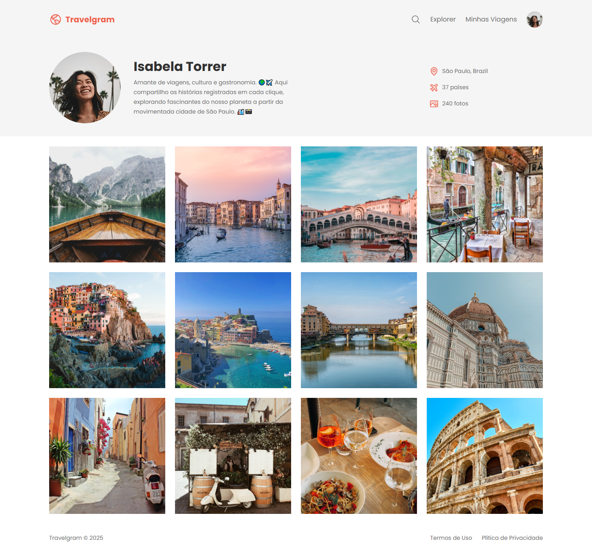

# 🌍 Travelgram | Perfil de Viagens

Este projeto foi desenvolvido com o objetivo de praticar conceitos de **HTML e CSS**, com foco especial na criação de um layout e visualmente agradável. A proposta é simular um perfil de viagens inspirado em redes sociais, onde a usuária Isabela Torres compartilha seus registros ao redor do mundo.

---

## 🧠 Conceitos Trabalhados

- Estruturação semântica com HTML5.
- Estilização avançada com CSS, utilizando variáveis CSS (`:root`).
- Layouts flexíveis com `flexbox`.
- Organização de componentes visuais como menu, perfil, galeria e rodapé.
- Importação de fontes do Google Fonts.

---

## 🔍 Preview do Projeto

> 📸 A galeria exibe fotos de viagens, com foco em um design limpo, responsivo.

---

## 🧱 Tecnologias Utilizadas

- **HTML5**
- **CSS3**
- **Google Fonts (Poppins)**
- **Flexbox**

---

## 📄 Licença

Este projeto está licenciado sob a MIT License.
Você pode usar, modificar e distribuir como quiser.
